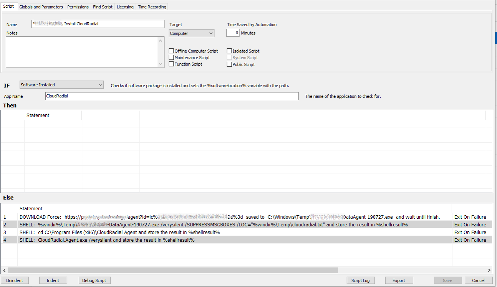

I’ve made some tweaks as I found the previous one didn’t work on certain servers/workstations due to UAC blocking it. I haven’t had any problems with the below so far on many different endpoints now:
 
1. Obtain link to CloudRadial agent
1. Go to Automation > Scripts > View Scripts and Add
1. Name your script – this script is for one agent only and must be repeated for additional agents
1. IF Software Installed, App Name = CloudRadial
1. Then = Leave this section blank
1. Else =

   a. DOWNLOAD Force: https://YOURLINK/agent?id=12345 saved to C:\Windows\Temp\ATLFulfilment-DataAgent-190727.exe and wait until finish.
   
   b. SHELL: %windir%\Temp\ATLFulfilment-DataAgent-190727.exe /verysilent /SUPPRESSMSGBOXES /LOG="%windir%\Temp\cloudradial.txt" and store the result in %shellresult%
   
   c. SHELL: cd C:\Program Files (x86)\CloudRadial Agent and store the result in %shellresult% 
   
   d. SHELL: CloudRadial.Agent.exe /verysilent and store the result in %shellresult%
 

 
Special thanks
Sarah Nimmo
