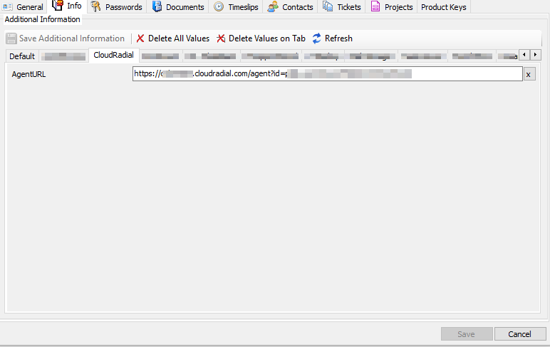

This is the latest one, have been testing with Nat so far so good, just added a .NET 4.7 check
 
Just get the URL from CloudRadial Client settings
Then in Automate open the client and put the URL here, and make sure to click Save Additional Information

#### Special Thanks
Turnkeyit.com.au
